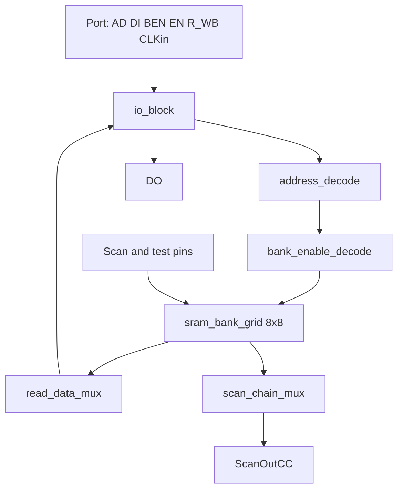

# sram

On-chip SRAM block for the Chipathon project. The block is a tiled wrapper
around an 8x8 grid of single-port 1024x32 SRAM hard macros, exposing a
single logical memory of 64 K words at 32 bits per word (256 KiB).

## 1. Purpose

`sram` is the project's first standalone tape-out block. It serves two
roles:

- A small, low-risk module that exercises the full design and tape-out
  flow end to end (RTL, verification, synthesis, place and route,
  signoff).
- The on-chip storage primitive used by later compute blocks. The
  external interface and address map are stable and reusable.

## 2. Scope and non-goals

In scope:

- Tiling and connection of 64 single-port 1024x32 SRAM macros.
- Word-address decode and one-hot bank enable generation.
- Read-data mux across the 64 macros.
- Byte-enable forwarding from the wrapper port to each macro.
- Test and power pin propagation to the macros.
- An optional bus wrapper layer (Wishbone B4 slave) presented as a
  separate module on top of the core SRAM block.

Out of scope (these belong inside the hard macro or to other blocks):

- Bitcell, sense amplifier, write driver, precharge, column mux,
  wordline driver, predecoder, replica column, and macro-level timing
  control. All of these are internal to the 1024x32 macro and are not
  implemented in RTL.
- Multi-port behavior (the macro is single-port; the wrapper is
  single-port).
- Caching, ECC, scrubbing.
- DMA, prefetch, and any host transfer logic outside a thin bus
  wrapper.

## 3. Top-level structure

The block is conceptually three layers:

1. `io_block` — registers and steers wrapper-level signals to the
   internal pipeline, and presents the read data back at the port.
2. Decode and mux — `address_decode`, `bank_enable_decode`,
   `read_data_mux`, and `scan_chain_mux` route control and data
   between the port and the macro grid.
3. `sram_bank_grid` — 64 instances of the 1024x32 macro arranged as
   eight rows by eight columns.

## 4. Capacity and address map

| Parameter           | Value                          |
| ---                 | ---                            |
| Macro primitive     | 1024 words x 32 bits, 1 port   |
| Bank rows           | 8                              |
| Bank columns        | 8                              |
| Total banks         | 64                             |
| Words per bank      | 1024                           |
| Words total         | 65 536                         |
| Bytes total         | 262 144 (256 KiB)              |
| Word width          | 32 bits                        |
| Word address width  | 16 bits                        |
| Local address width | 10 bits                        |
| Bank-select width   | 6 bits                         |

Address split:

| Field        | Bits         | Use                                         |
| ---          | ---          | ---                                         |
| `local_addr` | `addr[9:0]`  | Word address inside the selected macro      |
| `bank_col`   | `addr[12:10]`| Macro column (0..7) in the 8x8 grid         |
| `bank_row`   | `addr[15:13]`| Macro row (0..7) in the 8x8 grid            |
| `bank_index` | derived      | `bank_row * 8 + bank_col`, range 0..63      |

Putting `bank_col` in the lower address field keeps consecutive word
addresses landing in adjacent column banks first. This concentrates
sequential bursts in one row of macros, which makes routing of the
read-data mux easier and reduces toggling on cross-row data lanes.

The address map is rationale-only at this stage. The single normative
rule is:

- The bottom 10 bits address inside a macro.
- The top 6 bits select one of 64 macros.
- Software and downstream blocks treat the SRAM as a flat 64 K x 32
  memory; they should not assume a specific bank layout.

## 5. External interface

The core SRAM block exposes a macro-style synchronous SRAM port. All
inputs are sampled on the rising edge of `CLKin`. Read data appears on
`DO` after the macro's read latency.

| Signal     | Dir  | Width | Description                                         |
| ---        | ---  | ---   | ---                                                 |
| `CLKin`    | in   | 1     | Memory clock                                        |
| `EN`       | in   | 1     | Active-high port enable                             |
| `R_WB`     | in   | 1     | 1 = read, 0 = write                                 |
| `AD`       | in   | 16    | Word address                                        |
| `DI`       | in   | 32    | Write data                                          |
| `BEN`      | in   | 32    | Bit-level write mask. `BEN[i]` = 1 enables write to `DI[i]`. Byte writes are expressed as `{8{sel[3]}, 8{sel[2]}, 8{sel[1]}, 8{sel[0]}}`. |
| `DO`       | out  | 32    | Read data                                           |
| `ScanInCC` | in   | 1     | Scan chain input (test mode only)                   |
| `ScanOutCC`| out  | 1     | Scan chain output (test mode only)                  |
| `TM`       | in   | 1     | Test mode enable                                    |
| `SM`       | in   | 1     | Scan mode enable                                    |
| `WLBI`     | in   | 1     | Wordline burn-in test pin                           |
| `WLOFF`    | in   | 1     | Wordline disable test pin                           |
| Power pins | in   | -     | Macro power and ground rails                        |

In functional operation `TM`, `SM`, `WLBI`, and `WLOFF` are tied
inactive. They are exposed at the wrapper port so that scan and burn-in
can be driven coherently across all 64 macros during silicon test.

The optional bus wrapper layer is described in section 9.

## 6. Internal block specifications

### 6.1 `io_block`

- Optionally registers `AD`, `DI`, `BEN`, `EN`, and `R_WB` on the
  request side to ease timing closure.
- Registers `DO` on the return path so the wrapper presents
  registered read data at its port.
- Forwards test and power pins unchanged.
- Default policy: one register stage on request and one on response.
  The request-side stage may be removed if synthesis closes timing
  without it.

### 6.2 `address_decode`

- Splits `AD[15:0]` into `bank_index = AD[15:10]` and
  `local_addr = AD[9:0]`.
- Pure combinational; no state.

### 6.3 `bank_enable_decode`

- Generates `bank_en[63:0]`, a one-hot vector.
- `bank_en[i] = EN && (bank_index == i)`.
- Drives the `EN` pin of macro `i`. All other macros stay disabled,
  which keeps unselected macros in their lowest-power state.

### 6.4 `sram_bank_grid`

- 64 instances of the 1024x32 macro, indexed `bank[row][col]`.
- All macros share `CLKin`, `R_WB`, `DI`, `BEN`, `local_addr`, `TM`,
  `SM`, `WLBI`, `WLOFF`, and the power rails.
- Each macro's `EN` is driven by its element of `bank_en`.
- Each macro's `DO` is fed into `read_data_mux`.

The wrapper does not implement a row decoder, predecoder, wordline
driver, bitcell array, sense amplifier, write driver, precharge,
replica column, or any macro-level timing control. These all live
inside the hard macro.

### 6.5 `read_data_mux`

- 64-to-1 mux of 32-bit lanes.
- Selected by the bank index that produced the active read.
- Implemented as a registered `bank_index` on the response side, plus
  a one-hot or binary mux structure (synthesis chooses).
- Output drives `io_block`'s response register.

### 6.6 `scan_chain_mux`

- Combines the 64 `ScanOutCC` macro outputs into a single block-level
  `ScanOutCC`.
- Default style: a chain. The block exposes one `ScanInCC` input and
  one `ScanOutCC` output. Internally, `ScanOutCC` of bank `i` feeds
  `ScanInCC` of bank `i+1`, with bank 0's `ScanInCC` driven from the
  wrapper port and bank 63's `ScanOutCC` driven to the wrapper output.
- This keeps scan diagnosis simple: a single sweep covers all macros.

## 7. Timing model

The block targets a single-cycle access at the wrapper port:

- Cycle 0: `EN`, `R_WB`, `AD`, `DI`, `BEN` valid at the port.
- Cycle 1: `DO` valid at the port for a read launched in cycle 0.

This model assumes the macro completes a read or write in one clock
cycle and that one register stage on the response side is sufficient
to absorb mux delay. If the macro requires additional latency, the
block extends to one extra cycle by adding a pipeline stage in
`io_block`. The wrapper does not insert wait states.

Back-to-back transactions are supported every cycle. Write-after-read,
read-after-write, and read-after-read to the same address follow the
underlying macro's behavior; no bypass is implemented.

## 8. Reset and test pin policy

- The macro has no synchronous reset. After power-up, contents are
  undefined. Software is expected to write a region before reading it,
  or use a known-pattern initialization sequence.
- `TM`, `SM`, `WLBI`, and `WLOFF` are tied to their inactive state
  during functional operation. They are wired to package-visible pins
  (or top-level test ports) so silicon test can drive them.
- Scan: see section 6.6.

## 9. Optional bus wrapper

A separate top-level module wraps the SRAM port in a Wishbone B4
slave interface, for direct attachment to a host bus.

- Address: word-aligned 32-bit Wishbone address, with the bottom two
  bits unused at the SRAM boundary. The next 16 bits map to the SRAM
  word address `AD[15:0]`.
- `wbs_sel_i[3:0]` expands to the 32-bit `BEN` as
  `{8{sel[3]}, 8{sel[2]}, 8{sel[1]}, 8{sel[0]}}`.
- `wbs_we_i` drives `R_WB` as `R_WB = !wbs_we_i`.
- `wbs_cyc_i && wbs_stb_i` drives `EN`.
- `wbs_ack_o` is asserted for one cycle when a transaction lands.
- `wbs_dat_o` returns `DO` for reads, zero otherwise.

The bus wrapper is a thin translation layer. It contains no buffering,
arbitration, or out-of-order behavior. Only one outstanding transaction
is permitted.

## 10. Parameters

The block is parameterized so the same source can target the 8x8
default and smaller smoke-test variants:

- `BANK_ROWS` (default 8)
- `BANK_COLS` (default 8)
- `LOCAL_ADDR_W` (fixed 10, set by the macro)
- `WORD_WIDTH` (fixed 32, set by the macro)

Derived `localparam`s:

- `NUM_BANKS = BANK_ROWS * BANK_COLS`
- `BANK_SEL_W = $clog2(NUM_BANKS)`
- `WORD_ADDR_W = LOCAL_ADDR_W + BANK_SEL_W`

Implementations should use `generate` loops indexed by row and column
rather than enumerating 64 instances by hand. This keeps a 2x2 (4 KiB)
smoke variant and the 8x8 (256 KiB) production variant compiled from
the same source.

## 11. Word width rationale

A 32-bit word width matches the macro and packs the formats this
project will store later:

| Stored format     | Values per 32-bit word |
| ---               | ---:                   |
| FP32              | 1                      |
| FP16 / BF16       | 2                      |
| INT8 / FP8        | 4                      |
| INT4 / NF4        | 8                      |
| INT2              | 16                     |

The SRAM block is format-neutral. Higher-level blocks pack and unpack
sub-word formats; the SRAM stores raw 32-bit words.

## 12. Verification plan

Direct tests:

- Address decode: for every bank `i` in 0..63, confirm
  `bank_index = i` exactly when `AD[15:10] = i`, and that
  `bank_en[i]` is the only asserted enable.
- Walking-1 / walking-0 across `bank_en` to confirm no parasitic
  decode glitches.
- Per-bank write and readback: write a known pattern to every word in
  every bank, then read back and compare. Patterns: all-zero, all-one,
  alternating 0xAAAAAAAA / 0x55555555, address-as-data.
- Byte enable: for each byte lane, write only that lane and confirm
  the other lanes are unchanged.
- Bit enable: a sparse test of `BEN` patterns that are not byte-wide,
  to confirm the macro honors arbitrary bit masks.
- Read-after-write to the same word, same bank, and across bank
  boundaries.
- Back-to-back transactions: confirm one transaction per cycle holds
  at the target frequency.
- Test-pin tie-off: confirm functional operation when `TM`, `SM`,
  `WLBI`, `WLOFF` are inactive, and that asserting them does not
  corrupt stored data.
- Scan chain: shift a known bit pattern through all 64 macros via the
  daisy chain and confirm it appears at `ScanOutCC` after the expected
  number of cycles.

Random regression:

- Constrained-random sequence of read and write transactions against
  a behavioral memory model that mirrors the SRAM's contents. Compare
  every read against the model.
- Coverage points: every bank touched, every byte lane written, every
  bit position toggled, both read and write at every bank.
- Failure modes to catch: address aliasing across banks, byte-enable
  expansion errors, mux selecting the wrong bank, response register
  latency drift.

## 13. Physical design notes

- Floorplan: 8x8 macro grid. Equal channels between rows and columns
  for routing.
- Place the read-data mux and io block on one edge of the grid (the
  side closest to the chip's host or compute interface), so that
  `DO` traces are local to that edge.
- Power: continuous straps along macro columns. Tie macro power and
  ground pins to those straps with short, low-resistance connections.
- Macro pin access: reserve routing channels on the macro pin side to
  guarantee router success at high utilization.
- Halos: keep standard cells out of the macro keep-out region to
  preserve macro analog performance.
- Clock: single-domain. Buffer `CLKin` to the 64 macros from a common
  point to keep skew bounded.

## 14. Open items

Items to confirm before RTL freeze:

- Macro read latency at the target clock frequency. The current
  timing model assumes one cycle. If the macro needs more, the
  pipeline stage count in `io_block` increases.
- Scan-chain ordering across the 8x8 grid. The default chain order is
  row-major; physical design may prefer a snake order to minimize
  wiring.
- Whether the bus wrapper is included in the first tape-out, or kept
  out of scope to reduce verification surface.
